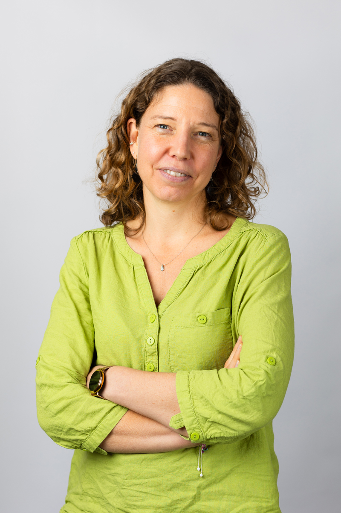

## À propos

+-----------------------------------------------------+---------------------------------------------------------------------------------------------------------------------------------------------------------------------+
| {width="190"} | Data scientist avec un background en écologie, je conçois des outils permettant de transformer des données complexes en supports d'analyse et d'aide à la décision. |
|                                                     |                                                                                                                                                                     |
|                                                     | Mes domaines d'intérêt :                                                                                                                                            |
|                                                     |                                                                                                                                                                     |
|                                                     | -   extraction et exploration de données                                                                                                                            |
|                                                     | -   data science (machine learning, optimisation de modèles)                                                                                                        |
|                                                     | -   data-viz et infographies                                                                                                                                        |
|                                                     | -   outils interactifs                                                                                                                                              |
|                                                     | -   Formation et ludopédagogie                                                                                                                                      |
+-----------------------------------------------------+---------------------------------------------------------------------------------------------------------------------------------------------------------------------+

## Projets

-   Dashboard de [pilotage d'activité entreprenarial](https://arcoop.ecolibres.fr/)
-   Outil de visualisation interactive de résultat d'expérimentation terrain
-   Outil interactif d'aide à l'analyse statistique de données écologique
-   Test de modèles de Large Language Models pour la classification de ressources bibliographiques selon un reféreniel structuré (référentiel RAMEAU)
-   Prototype d'application avec évaluation d"un Eco-Score sur la base des données en open-data de [OpenFoodFact](https://fr.openfoodfacts.org/)
-   Modélisation de la prise de décision concernant l'attribution d'un prêt bancaire
-   [Médiathèque interactive de ressources sur la redirection écologique](https://mediatheque-redirection-ecologique.streamlit.app/)

------------------------------------------------------------------------

## Parcours

### 2024 – aujourd'hui

***Fondatrice des Solutions [EcoLibres](https://www.ecolibres.fr/)***

Data science et développement d'outils d'analyse. Auvergne-Rhône-Alpes

### 2021 – 2023

***Entrepreneure indépendante en Coopérative d'Activité et d'Emploi (CAE [Arcoop](https://www.arcoop.fr/))***

Prestation en analyse de données

Valence et France en remote

### 2013 - 2020

*I**ngénieur de recherche en entreprise***

Modélisation adaptée à l'agriculture de précision pour le développement d'outils d'aide à la décision pour les pratiques agricoles.

-   [Carbon Bee AgTech](https://carbonbee.fr/), Valence

-   [ITK](https://www.itk.fr/), Montpellier

### 2009 - 2013

***Recherche et analyse de données environnementales***

-   [INRAE](https://mistea.montpellier.hub.inrae.fr/), Montpellier

-   Université de Lausanne, Lausanne, Suisse

-   [WSL](https://www.wsl.ch/fr/), Lausanne, Suisse

### 2004 - 2009

***Thèse de docotrat en écologie végétale***

Analyse de la résistance des communautés végétales aux plantes envahissantes

[Ecole Polytechnique Fédérale de Lausanne](https://archiveweb.epfl.ch/ecos.epfl.ch/) (EPFL), Suisse

### 2001 – 2004

***Formation scientifique en écologie et analyse de données***

Formation d'ingénieur agronome, spécialisation "Génie de l'environnement"

Option Préservation, Aménagement des Milieux et Ecologie Quantitative

[Agrocampus Ouest](https://www.institut-agro-rennes-angers.fr/formation/ingenieurs/specialisations-dingenieur/genie-de-lenvironnement), Rennes
